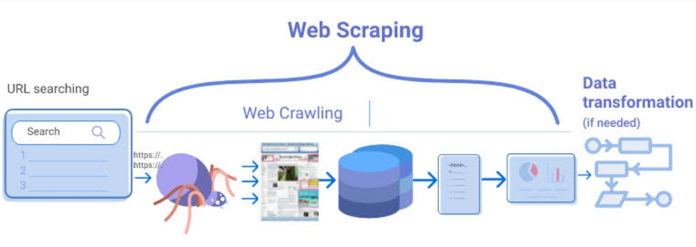
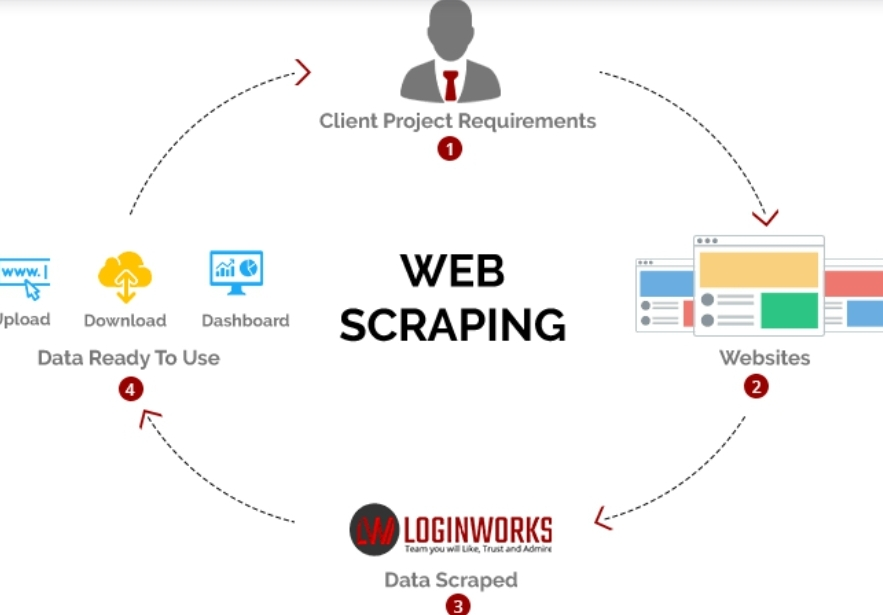
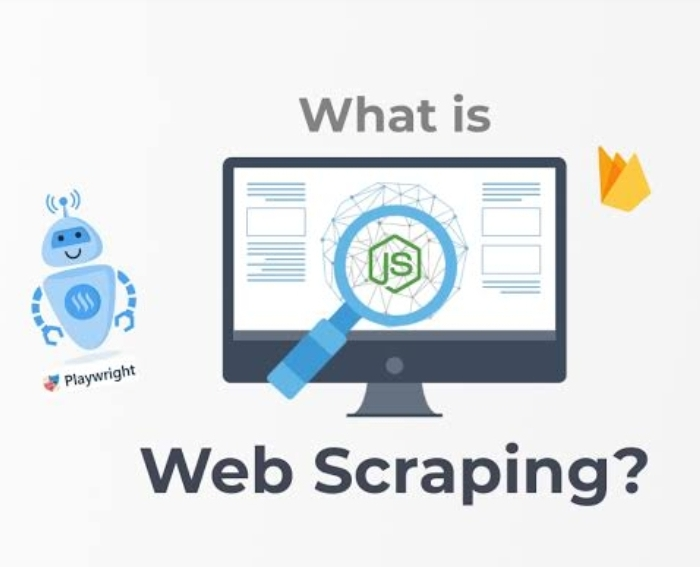
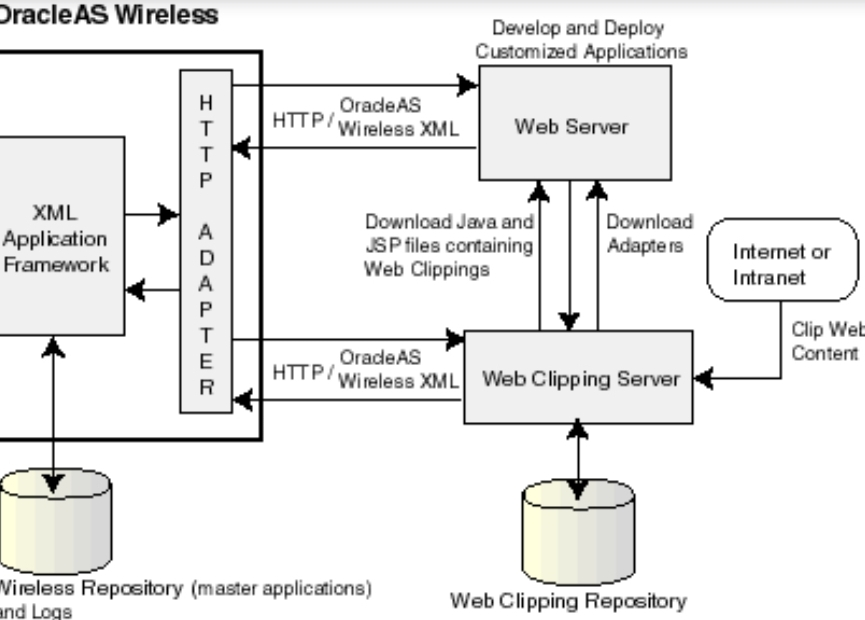
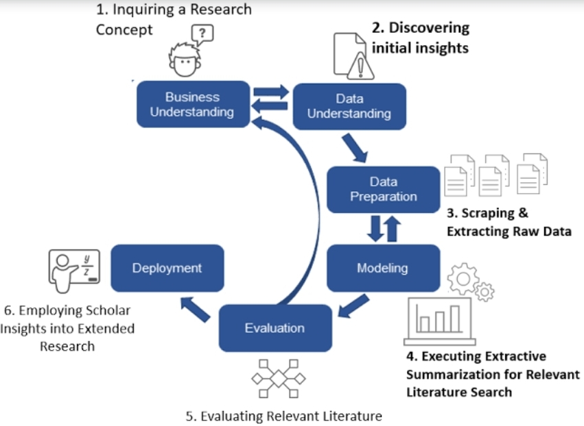
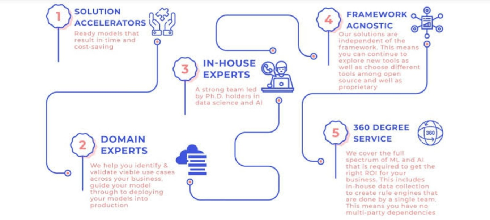
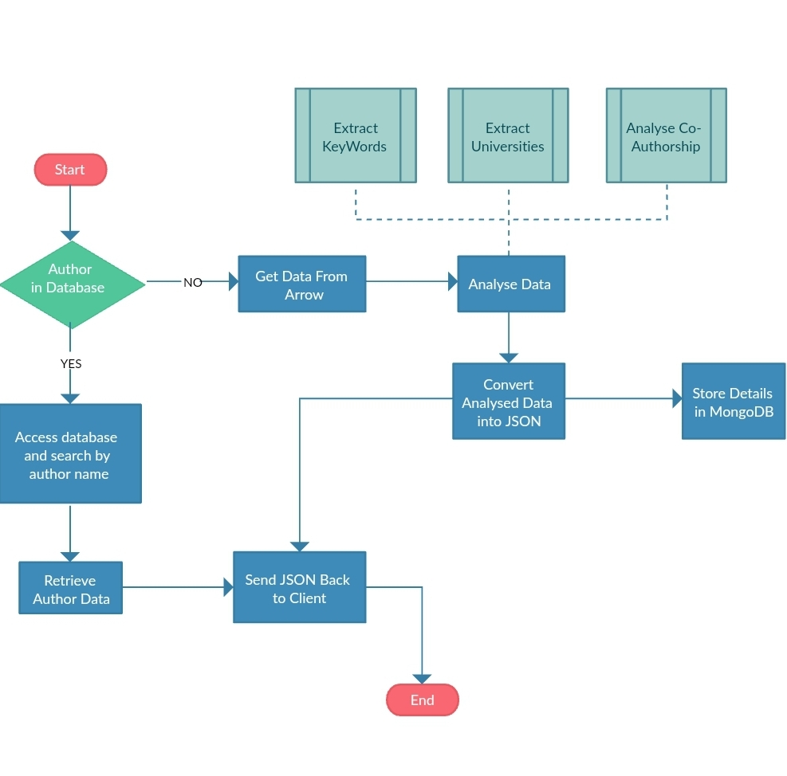
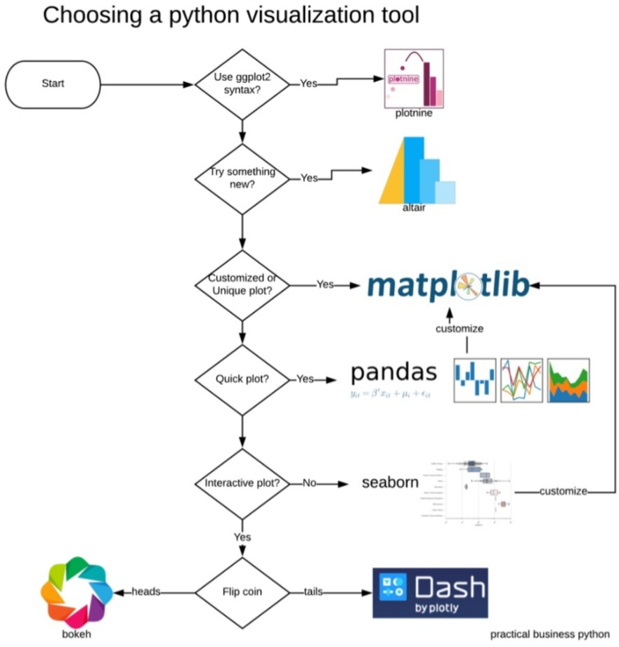
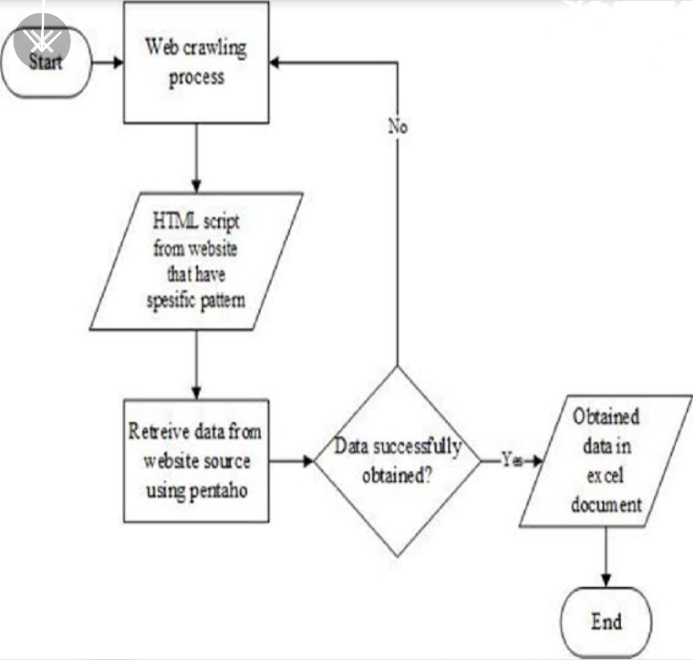
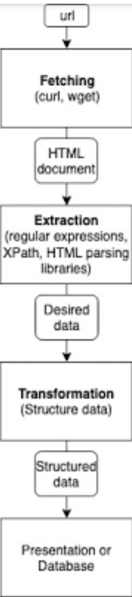

**TEAM MEMBERS:**

MYTHILI K

SNEHA.S

**AIM:**

To write a program for web scrapping and understanding what are the modules used in it and how to implement that.

How web scrapping is done from the website.

Basic functions from the module(Beautiful soup) used.

**DESCRIPTION:**

**WEB SCRAPING** 

☆Web Scraping (also termed Screen Scraping, Web Data Extraction, Web Harvesting etc.) is a technique used to automatically extract large amounts of data from websites and save it to a file or database. The data scraped will usually be in tabular/spreadsheet format.

Data displayed by websites can only be viewed using a web browser. Most websites do not allow you to save a copy of this data to a storage location or database. If you need the data, the only option is to manually copy and paste the data - a very tedious job which can take many hours or days to complete. Web Scraping is the technique of automating this process, so that instead of manually copying the data from websites, the Web Scraping software will perform the same task within a fraction of the time

☆**ARCHITECTURE OF WEB SCRAPING:**

☆**What is Web Scraping used for?**

Web Scraping is used for data. Access to relevant data and having methods to analyze it (and performing intelligent actions based on analysis) can make a huge difference in the success and growth of most businesses in the modern world. Data collection and analysis is important even for government, non-profit and educational institutions.

The following are few of the many uses of Web Scraping..

\1. In E-Commerce, Web Scraping is used for competition monitoring and price comparisons.

\2. In Marketing, Web Scraping is used for lead generation, to build phone and email lists for cold outreach.

\3. In Real Estate, Web Scraping is used to collect property details as well as contact details of agents and owners.

\4. Web Scraping is used to collect training data for Machine Learning models.

☆How to scrape data from websites?

Using a web scraping software,

Web Scraping software falls under 2 categories. First, which can be locally installed in your computer and second, which runs in the cloud (browser based). WebHarvy, OutWit Hub, Visual Web Ripper etc. are examples of web scraping software which can be installed in your computer, whereas import.io, Mozenda, ParseHub, OctoParse etc. are examples of cloud data extraction platforms.

☆**Objective if this Project:**

We will be creating an application which will perform web scraping of hot posts from a subreddit .

☆CHOOSING A VISUALIZATION TOOL:

☆Project Context/description :

☆Web scraping, also termed as web data extraction, is the process of collecting structured data in an automated way. Generally web scraping is used by businesses for making use of the vast amount of publicly available information, so that they are able to make smarter decisions. In our project though, we are going to have some fun with it by web scraping popular posts from a subreddit. If you don't know what a subreddit is - subreddits are like groups on Reddit, the  most popular website!

☆Web Scraping has to be used only for learning purposes. Any other attempts to use the data scraped might result in legal action or Your IP might get blocked.

☆**High-Level Approach**

Web scrape content which you want to post on FB, for example memes, from a subreddit.

☆Perform Selenium Web Automation for automatically sharing hot posts from a subreddit in a dedicated app like Facebook.

**TECHNOLOGY USED:**

Google colabratory 

**EXPECTED OUTPUT:**

Give the output for basic functionalities in the module.

We will get the cleansed data from the website

Converting raw data from website to manipulated data.
